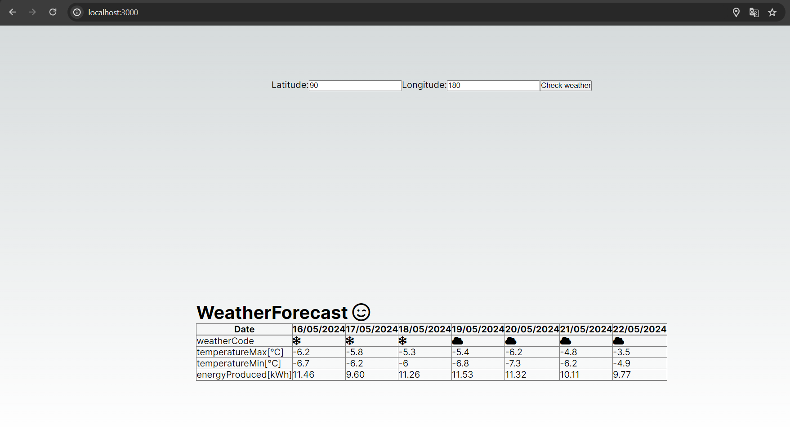
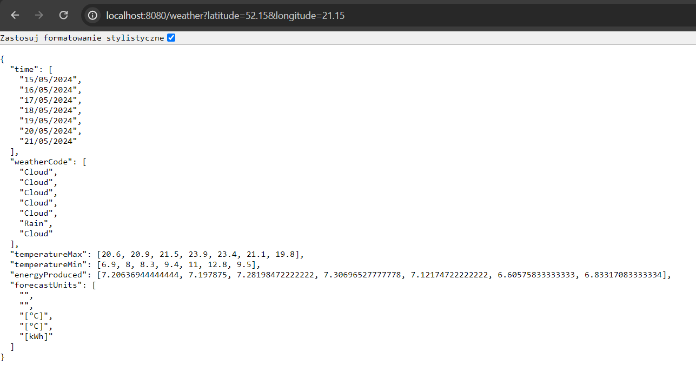

# SimpleWeatherAPI

This project is a web application that fetches data from an external API endpoint **[https://open-meteo.com/](https://open-meteo.com/) ** using Spring Boot, processes it, and displays it on a web page using Next.js.

## Table of Contents

- [How to run](#How-to-run)
- [Features](#features)
- [Technologies](#technologies)
- [Screenshots](#Screenshots)

## How to run

- You have to follow instructions from frontend and backend readmes.

## Features

- Fetch data from a specified API endpoint using Spring Boot
- Process the received data in the backend, calculate energy produced by solar panels
- Display the processed data on a web page using Next.js
- Get user location

## Technologies

- Java 21
- Spring Boot
- Maven
- Next.js
- React
- Node.js
- [https://open-meteo.com/](https://open-meteo.com/) data source
- [https://fontawesome.com/](https://fontawesome.com/) weather icons

  ## Screenshots
Site:

Data format:

